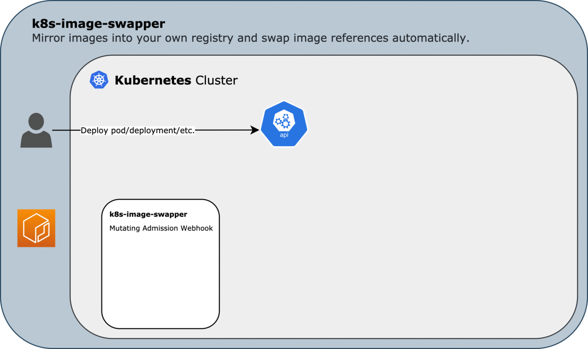

  
  <h3 align="center">k8s-image-swapper</h3>
  
Mirror images into your own registry and swap image references automatically.

`k8s-image-swapper` is a mutating webhook for Kubernetes, downloading images into your own registry and pointing the images to that new location.
It is an alternative to a [docker pull-through proxy](https://docs.docker.com/registry/recipes/mirror/).
The feature set was primarily designed with Amazon ECR in mind but may work with other registries.

## Benefits

Using `k8s-image-swapper` will improve the overall availability, reliability, durability and resiliency of your
Kubernetes cluster by keeping 3rd-party images mirrored into your own registry.

`k8s-image-swapper` will transparently consolidate all images into a single registry without the need to adjust manifests
therefore reducing the impact of external registry failures, rate limiting, network issues, change or removal of images
while reducing data traffic and therefore cost.

**TL;DR:**

* Protect against:
    * external registry failure ([quay.io outage](https://www.reddit.com/r/devops/comments/f9kiej/quayio_is_experiencing_an_outage/))
    * image pull rate limiting ([docker.io rate limits](https://www.docker.com/blog/scaling-docker-to-serve-millions-more-developers-network-egress/))
    * accidental image changes
    * removal of images
* Use in air-gaped environments without the need to change manifests
* Reduce NAT ingress traffic/cost

## How it works

